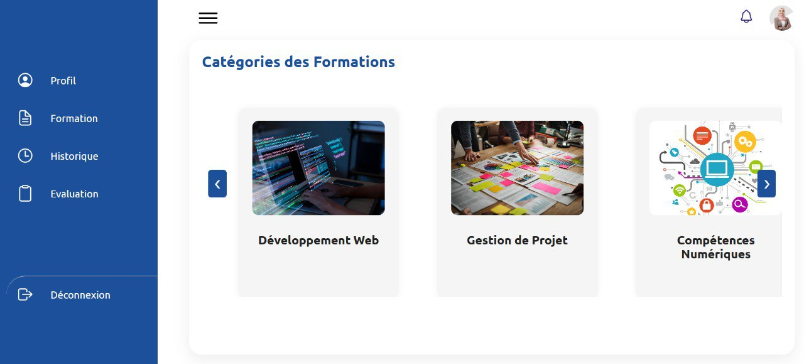
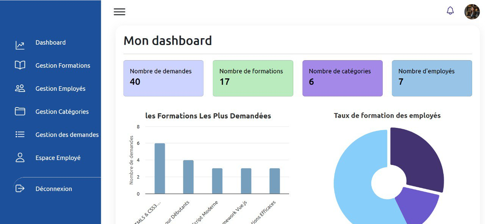
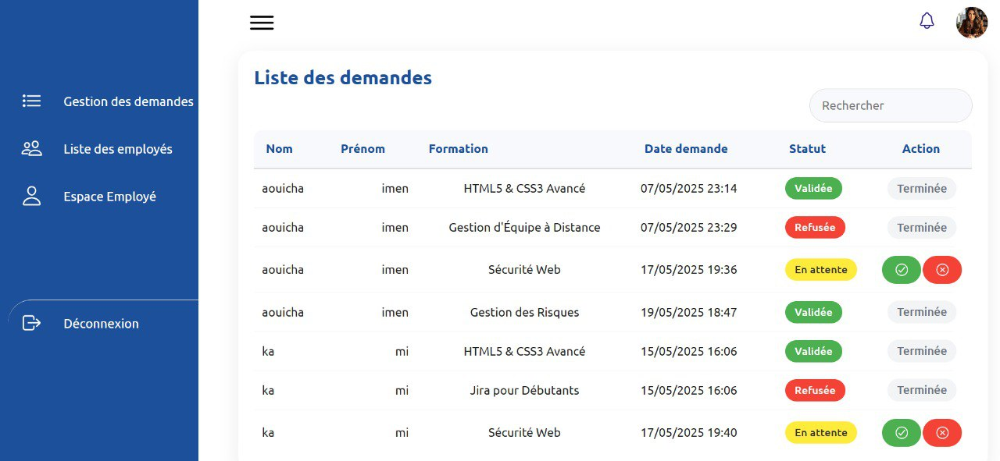

# 🧠 Employee Management System
The Employee Management System is a comprehensive web application designed to manage employee data, formations, and demands. It provides a robust platform for administrators to oversee employee information, track formations, and handle demands. The system is built using Laravel, a popular PHP framework, and utilizes a range of technologies to ensure a seamless user experience.

## 🚀 Features
* Employee management: create, read, update, and delete employee records
* Formation management: create, read, update, and delete formation records
* Demand management: create, read, update, and delete demand records
* Authentication and authorization: secure login and registration system with role-based access control
* Middleware-based security: protect routes and ensure only authorized access
* API endpoints: provide a range of API endpoints for interacting with the system

## 🛠️ Tech Stack
* Frontend: HTML, CSS, JavaScript
* Backend: PHP, Laravel
* Database: MySQL
* API: RESTful API
* Authentication: Laravel Sanctum
* Middleware: Custom authentication middleware
* Dependencies: Illuminate, Laravel Collective, Laravel UI

## 📦 Installation
To install the Employee Management System, follow these steps:
1. Clone the repository: `git clone https://github.com/your-repo/employee-management-system.git`
2. Install dependencies: `composer install`
3. Configure environment variables: `cp .env.example .env` and update the database settings
4. Run migrations: `php artisan migrate`
5. Seed the database: `php artisan db:seed`
6. Start the server: `php artisan serve`

## 💻 Usage
To use the Employee Management System, follow these steps:
1. Register as an administrator: `http://localhost:8000/register`
2. Login as an administrator: `http://localhost:8000/login`
3. Access the dashboard: `http://localhost:8000/dashboard`
4. Manage employees, formations, and demands using the provided API endpoints

## 📂 Project Structure
```markdown
employee-management-system/
app/
Http/
Controllers/
Admin/
Auth/
Employe/
Formation/
...
Models/
Employe.php
Formation.php
Categorie.php
...
...
config/
database.php
...
public/
index.php
...
resources/
views/
...
routes/
api.php
web.php
...
...

```

## 📸 Screenshots





## 🤝 Contributing
To contribute to the Employee Management System, please follow these steps:
1. Fork the repository: `git fork https://github.com/your-repo/employee-management-system.git`
2. Create a new branch: `git branch feature/your-feature`
3. Make changes and commit: `git commit -m "Your commit message"`
4. Push changes: `git push origin feature/your-feature`
5. Create a pull request: `https://github.com/your-repo/employee-management-system/pulls`

## 📝 License
The Employee Management System is licensed under the MIT License.

## 📬 Contact
For any questions or concerns, please contact me at [sarah.arhab14@example.com](mailto:sarah.arhab14@example.com)


